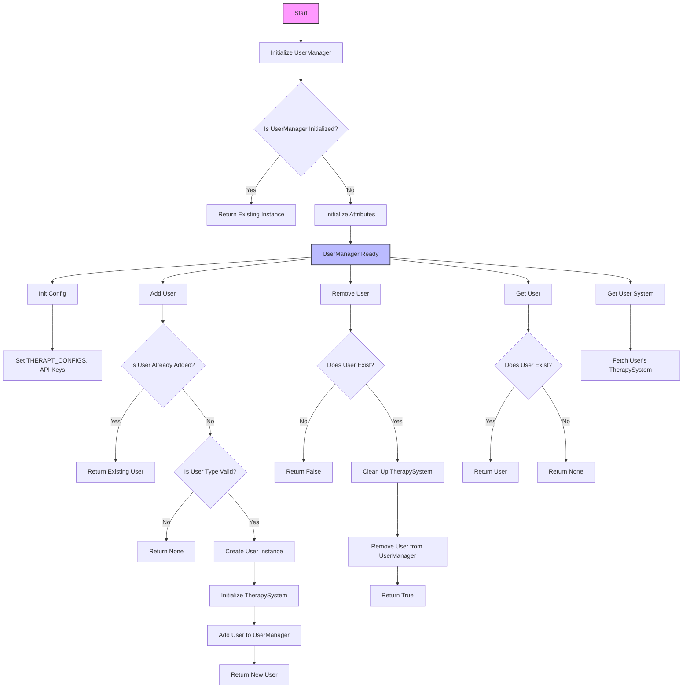
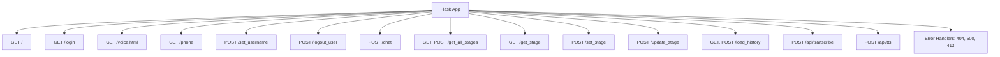

# 部署设置基础
修改config.py中的参数，从而更换疗法技术.
NORMAL_PSYCHOLOGY_METHOD = 'cbt'  # 或 'sfbt'

## **配置文件的设计特点**  config.py

1. **集中化管理**：

   - 所有关键配置项（如 API 密钥、文件路径、默认方法）集中在一个地方，便于维护和修改。

2. **灵活性**：

   - 通过环境变量（如 `OPENAI_API_KEY`）和动态函数（如 `therapy_config`），可以轻松调整配置，适应不同的运行环境（开发、测试、生产）。

3. **可扩展性**：

   - 支持多种心理治疗方法（`sfbt` 和 `cbt`），并为每种方法提供独立的配置。
   - 如果需要添加新的方法，只需在 `therapy_config` 中添加对应的配置。

4. **安全性**：

   - 使用环境变量管理敏感信息（如 API 密钥），避免将密钥直接暴露在代码中（但 `CLAUDE_API_KEY` 目前未遵循此原则）。

5. **路径管理**：

   - 使用 `Path` 模块构建相对路径，避免硬编码绝对路径，提高代码的可移植性。

   

# UserManager 逻辑



# 路由



### **接口功能说明**

#### 1. **GET `/`**

- **功能**：渲染主页面。
- **作用**：为默认用户创建一个新的系统实例，并返回 `chat.html` 页面。
- **返回值**：HTML 页面。

#### 2. **GET `/login`**  --暂时没有用上，可以忽略

- **功能**：渲染登录页面。
- **作用**：为默认用户创建一个新的系统实例，并返回 `echo_psycho_login.html` 页面。
- **返回值**：HTML 页面。

#### 3. **GET `/voice.html`**  --暂时没有用上，可以忽略

- **功能**：渲染语音页面。
- **作用**：返回 `voice.html` 页面。
- **返回值**：HTML 页面。

#### 4. **GET `/phone`**--暂时没有用上，统一为'/'这个接口了，原本是为了避免手机用户修改提示词而定义的，由于发现过早考虑这些特性了，也就搁置了。

- **功能**：渲染手机页面。
- **作用**：为默认用户创建一个新的系统实例，并返回 `phone.html` 页面。
- **返回值**：HTML 页面。

#### 5. **POST `/set_username`**

- **功能**：设置用户名。
- 作用：
  - 接收 `username` 参数。
  - 验证用户名是否合法（长度大于 2）。
  - 创建用户并初始化对应的 `TherapySystem`。
- 参数：
  - `username`：用户名称。
- 返回值：
  - 成功：`{"success": true, "data": {"username": "xxx"}}`
  - 失败：`{"success": false, "error": "Invalid username"}`

#### 6. **POST `/logout_user`**

- **功能**：注销用户。
- 作用：
  - 接收 `username` 参数。
  - 删除用户及其 `TherapySystem`。
- 参数：
  - `username`：用户名称。
- 返回值：
  - 成功：`{"success": true, "data": {"message": "User logged out successfully"}}`
  - 失败：`{"success": false, "error": "No username provided"}`

#### 7. **POST `/chat`**

- **功能**：处理聊天请求。
- 作用：
  - 接收用户消息 `message`。
  - 获取用户的 `TherapySystem`。
  - 调用 `TherapySystem` 的 `get_response` 方法处理消息。
- 参数：
  - `message`：用户发送的消息。
- 返回值：
  - 成功：返回聊天响应、历史记录、当前阶段、任务等信息。
  - 失败：返回错误信息。

#### 8. **GET, POST `/get_all_stages`**

- **功能**：获取所有阶段。
- 作用：
  - 获取用户的 `TherapySystem`。
  - 返回所有阶段信息和当前阶段信息。
- 返回值：
  - 成功：`{"success": true, "data": {"stages": [...], "current_stage": {...}}}`
  - 失败：返回错误信息。

#### 9. **GET `/get_stage`**

- **功能**：获取指定阶段的内容。
- 作用：
  - 接收 `stage` 参数。
  - 获取用户的 `TherapySystem`。
  - 返回指定阶段的内容和当前阶段信息。
- 参数：
  - `stage`：阶段 ID。
- 返回值：
  - 成功：`{"success": true, "data": {"stage": "xxx", "stage_info": {...}, "current_stage": {...}}}`
  - 失败：返回错误信息。

#### 10. **POST `/set_stage`**

- **功能**：设置当前阶段。
- 作用：
  - 接收 `stage` 和 `task_id` 参数。
  - 获取用户的 `TherapySystem`。
  - 设置当前阶段和任务。
- 参数：
  - `stage`：阶段 ID。
  - `task_id`：任务 ID。
- 返回值：
  - 成功：`{"success": true, "data": {"current_stage": {...}}}`
  - 失败：返回错误信息。

#### 11. **POST `/update_stage`**

- **功能**：更新阶段内容。
- 作用：
  - 接收 `stage` 和 `content` 参数。
  - 验证 `content` 是否包含必要字段。
  - 更新阶段内容。
- 参数：
  - `stage`：阶段 ID。
  - `content`：阶段内容（包含 `id`, `name`, `description`, `tasks`）。
- 返回值：
  - 成功：`{"success": true, "data": {"stage": "xxx", "updated_content": {...}}}`
  - 失败：返回错误信息。

#### 12. **GET, POST `/load_history`**

- **功能**：获取聊天历史。
- 作用：
  - 获取用户的 `TherapySystem`。
  - 返回用户的聊天历史。
- 返回值：
  - 成功：`{"success": true, "data": {"history": [...]}}`
  - 失败：返回错误信息。

#### 13. **POST `/api/transcribe`**  --暂时用不上，由于语音部分前沿技术和需求的多变，这里就只做了实验性尝试，可以推翻这里的设计全新定义，不会影响既有逻辑。

- **功能**：语音转文字。
- 作用：
  - 接收音频文件 `file`。
  - 验证文件格式。
  - 调用 `TherapySystem` 的语音转文字功能。
- 参数：
  - `file`：音频文件。
- 返回值：
  - 成功：返回转录文本、聊天响应等信息。
  - 失败：返回错误信息。

#### 14. **POST `/api/tts`** --暂时用不上，由于语音部分前沿技术和需求的多变，这里就只做了实验性尝试，可以推翻这里的设计全新定义，不会影响既有逻辑。

- **功能**：文字转语音。
- 作用：
  - 接收文本 `text`。
  - 验证文本长度。
  - 调用 `TherapySystem` 的文字转语音功能。
- 参数：
  - `text`：要转换的文本。
- 返回值：
  - 成功：返回语音文件。
  - 失败：返回错误信息。

#### 15. **错误处理路由**

- **功能**：处理常见错误。
- 作用：
  - 404：返回 `Not Found` 错误。
  - 500：返回 `Internal Server Error`。
  - 413：返回 `File Too Large` 错误。
- 返回值：
  - 错误信息和对应的状态码。


## 关于多个大模型接口统一的处理

说明 **`OpenAIClient`** 和 **`ClaudeClient`** 类的设计目的，以及它们如何在接口上保持一致性以便统一使用：

------

# **统一接口设计文档**

## **背景**

在现代应用中，使用多个大型语言模型（LLMs）服务（如 OpenAI 和 Anthropic Claude）已成为常见需求。然而，由于不同服务的 API 格式和调用方式存在差异，直接集成多个服务会导致代码复杂度增加，维护成本上升。

为了解决这一问题，我们设计了两个类：`OpenAIClient` 和 `ClaudeClient`。这两个类通过提供一致的接口方法（如 `get_completion`），屏蔽了底层 API 的差异，使得开发者可以以统一的方式调用不同的 LLM 服务。

------

## **设计目标**

1. **接口一致性**：无论是 OpenAI 还是 Claude，调用方式保持一致，开发者无需关心底层实现细节。
2. **格式转换**：自动处理不同服务的消息格式差异，确保输入和输出的统一。
3. **易扩展性**：未来可以轻松添加其他 LLM 服务（如 Google Bard、Cohere 等），只需实现相同的接口方法。
4. **错误处理**：提供统一的错误处理机制，便于调试和日志记录。


**注意的点**

1.Openai的原来的system角色已经改为developer角色。

2.claude的system提示词必须放在聊天内容的第一条。并且它其实有缓存系统提示词的功能（目前的文档截止2025-01-01解释是以文字内容的完全一致性来缓存的，后续应当小心它以语义对比来）


# **`TherapySystemBase`** 类的详细解释，涵盖其设计目的、关键功能和实现细节：

------

## **类的整体设计目的**

`TherapySystemBase` 是一个心理治疗系统的基础类，设计用于：

1. **阶段管理**：支持心理治疗的多阶段流程，每个阶段包含多个任务。
2. **对话管理**：存储和管理用户与系统的聊天历史。
3. **模型集成**：支持通过 OpenAI 或 Claude 等模型生成对话响应。
4. **状态管理**：通过状态机管理当前阶段和任务，支持动态切换。
5. **可扩展性**：通过子类化实现不同心理治疗方法的具体逻辑，同时复用通用功能。

------

## **构造函数 (`__init__`)**

```python
def __init__(self, stage_file_path: str, prompt_file: str, user: str):  
```

- **参数**：
  - `stage_file_path`：存储阶段定义文件的路径。
  - `prompt_file`：存储基础提示词的文件路径。
  - `user`：当前用户的标识，用于生成用户专属的聊天历史文件。
- **主要初始化逻辑**：
  1. **路径设置**：
     - 阶段文件路径：`stage_file_path`。
     - 提示词文件路径：`prompt_file_path`。
     - 聊天历史文件路径：根据用户动态生成，存储在 `histories` 文件夹中。
  2. **初始化关键属性**：
     - `current_stage`：当前阶段。
     - `current_task`：当前任务。
     - `stages_config`：存储所有阶段的配置信息。
     - `chat_history`：存储用户的聊天历史。
     - `client`：AI 模型客户端（如 OpenAI 或 Claude）。
     - `basic_prompt`：基础提示词。
  3. **加载配置和历史**：
     - 加载基础提示词：`load_basic_prompt`。
     - 加载阶段配置：`load_stages`。
     - 加载聊天历史：`load_history_from_file`。
  4. **状态初始化**：
     - 初始化状态机：`_init_state_machine`。
     - 如果聊天历史中有最后一条助手消息，则从响应中提取阶段并设置当前阶段。

------

## **主要功能模块**

### **1. 子类化支持**

`TherapySystemBase` 是一个抽象基类，部分方法需要子类实现：

- `_init_state_machine`：初始化状态机。
- `_get_initial_message`：获取初始化消息。

------

### **2. AI 模型集成**

支持通过 OpenAI 或 Claude 客户端生成对话响应：

- **`init_openai(api_key)`**：初始化 OpenAI 客户端。
- **`init_claude(api_key)`**：初始化 Claude 客户端。

------

### **3. 阶段管理**

#### **加载阶段配置**

```python
def load_stages(self) -> Dict:  
```

- **功能**：从阶段定义文件中加载所有阶段的配置信息。
- 逻辑：
  1. 如果阶段文件不存在，返回空字典。
  2. 加载 JSON 文件内容。
  3. 将阶段信息存储在 `stages_config` 中，以阶段 ID 为键。
  4. 如果没有设置当前阶段，默认选择第一个阶段。
  5. 返回阶段配置信息。

#### **保存阶段配置**

```python
def save_stages(self) -> bool:  
```

- **功能**：将当前阶段配置信息保存到文件。
- 逻辑：
  1. 将阶段信息转为 JSON 格式。
  2. 保存到 `stage_file_path`。
  3. 返回保存状态。

#### **设置阶段**

```python
def set_stage(self, stage_id: str, task_id: Optional[str] = None) -> bool:  
```

- **功能**：切换当前阶段和任务。
- 逻辑：
  1. 验证阶段 ID 是否存在于 `stages_config` 中。
  2. 调用状态机切换到目标阶段。
  3. 设置当前阶段和任务（默认选择阶段中的第一个任务）。

------

### **4. 聊天历史管理**

#### **加载聊天历史**

```python
def load_history_from_file(self) -> bool:  
```

- **功能**：从历史文件中加载聊天记录。
- 逻辑：
  1. 如果历史文件存在，加载 JSON 内容到 `chat_history`。
  2. 如果文件不存在，初始化聊天历史，并添加初始消息（`hello` 字段）。

#### **保存聊天历史**

```python
def save_history_to_file(self) -> bool:  
```

- **功能**：将聊天历史保存到文件。
- 逻辑：
  1. 将聊天历史转为 JSON 格式。
  2. 保存到 `history_file_path`。

------

### **5. 阶段内容管理**

#### **获取当前阶段信息**

```python
def get_current_stage(self) -> Optional[Dict]:  
```

- **功能**：返回当前阶段及任务信息。
- 逻辑：
  1. 如果 `current_stage` 存在，返回阶段信息和当前任务。
  2. 否则返回 `None`。

#### **获取指定阶段内容**

```python
def get_stage_content(self, stage_id: str) -> Optional[Dict]:  
```

- **功能**：返回指定阶段的配置信息。
- 逻辑：
  1. 从 `stages_config` 中查找对应阶段。
  2. 如果找到，返回阶段内容；否则返回 `None`。

#### **更新阶段内容**

```python
def update_stage_content(self, stage_id: str, content: Dict) -> bool:  
```

- **功能**：更新指定阶段的配置信息。
- 逻辑：
  1. 验证 `content` 是否包含必要字段。
  2. 更新阶段信息到 `stages_config`。
  3. 保存更新后的阶段信息到文件。

------

### **6. 对话生成与响应**

#### **生成对话响应**

```python
def get_response(self, user_message: str) -> Dict:  
```

- **功能**：根据用户消息和阶段提示生成对话响应。
- 逻辑：
  1. 验证 AI 客户端是否已初始化。
  2. 生成系统提示（`basic_prompt` 和当前阶段提示）。
  3. 将聊天历史和用户消息组合为消息列表。
  4. 调用 AI 客户端生成响应。
  5. 从响应中提取阶段并切换（如果需要）。
  6. 更新聊天历史并保存到文件。
  7. 返回响应内容、阶段信息、任务信息等。

------

### **7. 阶段提取与匹配**

#### **从响应中提取阶段**

```python
def extract_stage_from_response(self, response: str) -> Optional[str]:  
```

- **功能**：从 AI 响应中提取阶段信息。
- 逻辑：
  1. 使用正则表达式匹配阶段标记（如 `>>[Stage Name]`）。
  2. 使用语义匹配器（`SemanticMatcherClient`）验证提取的阶段是否存在于配置中。
  3. 如果找到匹配的阶段，返回阶段 ID。